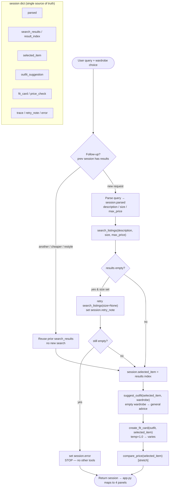

# SecondLook — planning.md

> Completed before writing implementation code. This spec and the agent diagram
> were used to direct AI tools to generate the implementation.

---

## Tools

### Tool 1: search_listings

**What it does:**
Searches the 100-item mock listings dataset for secondhand pieces that match a
keyword description, with optional size and price filters, and returns the
matches ranked by how well they fit the description.

**Input parameters:**
- `description` (str): Free-text keywords describing the wanted item, e.g. `"vintage graphic tee"`. Matched against each listing's title, description, style_tags, colors, brand, and category.
- `size` (str | None): Size to filter by, e.g. `"M"`. Case-insensitive, token-aware (`"M"` matches `"S/M"` and `"M/L"`). `None` skips the size filter.
- `max_price` (float | None): Inclusive price ceiling. `None` skips the price filter.

**What it returns:**
`list[dict]` of full listing dicts (`id, title, description, category, style_tags,
size, condition, price, colors, brand, platform`), sorted by relevance score
(highest first). Listings with a relevance score of 0 are dropped. Returns `[]`
when nothing matches — never raises.

**What happens if it fails or returns nothing:**
Returns an empty list. The planning loop detects `[]`, sets `session["error"]`
with a message telling the user what was searched and to loosen size/price or
reword, and stops before calling `suggest_outfit`. (Stretch: before erroring it
retries once with the size filter removed — see Additional Tools / retry note.)

---

### Tool 2: suggest_outfit

**What it does:**
Given a thrifted item and the user's wardrobe, asks the LLM to compose 1–2
complete, specific outfit combinations that pair the new item with named pieces
the user already owns.

**Input parameters:**
- `new_item` (dict): A listing dict from `search_listings` — the item being considered.
- `wardrobe` (dict): Wardrobe dict with an `items` key (list of wardrobe item dicts: `id, name, category, colors, style_tags, notes`). May be empty.

**What it returns:**
A non-empty `str` describing outfit(s): which wardrobe pieces to pair, plus
styling notes (tuck, roll, layer). When the wardrobe is empty it returns general
styling advice for the item instead.

**What happens if it fails or returns nothing:**
If `wardrobe["items"]` is empty → general-advice prompt path (still returns a
useful string). If the LLM call raises → caught and returns a plain fallback
string (`"Couldn't generate an outfit right now — try pairing it with neutral
basics..."`) so the agent keeps running.

---

### Tool 3: create_fit_card

**What it does:**
Turns the chosen outfit + item into a short, casual, shareable social-media
caption — the kind of thing someone captions an OOTD post with.

**Input parameters:**
- `outfit` (str): Outfit suggestion string from `suggest_outfit`.
- `new_item` (dict): The listing dict (for title, price, platform).

**What it returns:**
A 2–4 sentence `str` caption mentioning the item name, price, and platform once
each, in a casual voice. High temperature → varies across runs/inputs.

**What happens if it fails or returns nothing:**
If `outfit` is empty/whitespace → returns a descriptive error string immediately
(no LLM call). If the LLM call raises → caught, returns a simple templated
caption built from the item fields. Never raises.

---

### Additional Tools (stretch)

### Tool 4: compare_price (stretch — price comparison)

**What it does:**
Estimates whether a listing's price is fair by comparing it to the median price
of same-category listings in the dataset.

**Input parameters:**
- `item` (dict): A listing dict.

**What it returns:**
A `str` verdict like `"$22 is a good deal — below the $34 median for tops."`

**What happens if it fails or returns nothing:**
If no comparable category items exist, returns a neutral message ("not enough
comparable listings to judge"). Never raises.

**Retry with fallback (stretch — inside the planning loop):**
If `search_listings` returns `[]` and a `size` was supplied, the loop retries
once with `size=None`, records the adjustment in `session["retry_note"]`, and
only errors if the loosened search is still empty.

---

## Planning Loop

The loop is a linear pipeline with a conditional early-exit branch — behavior
changes based on what `search_listings` returns:

1. `_new_session(query, wardrobe)` creates the session dict.
2. **Parse** the query (regex) into `description`, `size`, `max_price`; store in `session["parsed"]`.
3. **Call `search_listings`** with parsed params; store in `session["search_results"]`.
   - If `[]` **and** a size was parsed → **retry** with `size=None`, set `session["retry_note"]`.
   - If still `[]` → set `session["error"]` (what was searched + what to try) and **return early**. `fit_card`/`outfit_suggestion` stay `None`. **suggest_outfit is NOT called.**
4. Otherwise `session["selected_item"] = search_results[0]` (top relevance).
5. **Call `suggest_outfit(selected_item, wardrobe)`**; store `session["outfit_suggestion"]`.
6. **Call `create_fit_card(outfit_suggestion, selected_item)`**; store `session["fit_card"]`.
7. (Stretch) **Call `compare_price(selected_item)`**; store `session["price_check"]`.
8. Return the session.

Done when either the error branch returns early (step 3) or the fit card is set
(step 6/7). The loop never calls all tools unconditionally — an empty search
result terminates the run.

**Branch 0 — conversation memory (multi-turn).** Before step 1, `_detect_followup`
checks for a previous session with results and a follow-up phrase
("another"/"cheaper"/"style it differently"). If matched, the agent **reuses the
prior `search_results` and skips `search_listings`**: "next" advances
`result_index`, "cheaper" picks the next-cheapest match (same category first),
"restyle" keeps the item and regenerates the outfit — then runs steps 5–7. Every
decision is appended to `session["trace"]` and shown in the UI's reasoning panel.

---

## State Management

Single `session` dict is the source of truth for one interaction. Each step
reads earlier fields and writes its own:

| Field | Written by | Read by |
|-------|-----------|---------|
| `query` | `_new_session` | parse step |
| `parsed` | parse step | `search_listings` call |
| `search_results` | `search_listings` | early-exit check, item select |
| `selected_item` | item-select step | `suggest_outfit`, `create_fit_card`, `compare_price` |
| `outfit_suggestion` | `suggest_outfit` | `create_fit_card` |
| `fit_card` | `create_fit_card` | UI |
| `price_check` | `compare_price` | UI |
| `error` / `retry_note` | loop branches | UI |

The item found by `search_listings` flows into `suggest_outfit` via
`session["selected_item"]` — the user never re-enters it. `app.py` reads the
final session dict and maps fields to the three output panels.

---

## Error Handling

| Tool | Failure mode | Agent response |
|------|-------------|----------------|
| search_listings | No results match the query | Retry once with size removed (if size was set); if still empty, set `error`: "No listings matched 'X' (size M, under $30). Try removing the size filter, raising your budget, or different keywords." Stop before other tools. |
| suggest_outfit | Wardrobe is empty | Switch to a general-styling-advice prompt; return concrete advice for the item instead of crashing. LLM exception → templated neutral-basics fallback string. |
| create_fit_card | Outfit input missing/incomplete | Empty/whitespace outfit → return descriptive error string, skip LLM. LLM exception → templated caption from item fields. |

---

## Architecture

### Diagram (Mermaid)



The **error path** branches off at `E2 → ERR` and terminates early. The
**conversation-memory path** (`FU → MEM`) skips `search_listings` entirely and
reuses the previous turn's results. Every step reads/writes the shared `session`
dict, and each decision is appended to `session.trace` (shown in the UI).

### Diagram (ASCII fallback)

```
User query (+ wardrobe choice)
    │
    ▼
Planning Loop (run_agent) ───────────────────────────────────┐
    │  parse query → session["parsed"]                       │
    │                                                        │
    ├─► search_listings(description, size, max_price)        │
    │       │ results == []                                  │
    │       │   ├─ size set? → retry size=None (retry_note)  │
    │       │   └─ still [] → session["error"] ──────────────┤► return early
    │       │ results == [item, ...]                         │   (outfit/fit_card = None)
    │       ▼                                                │
    │   Session: selected_item = results[0]                  │
    │       │                                                │
    ├─► suggest_outfit(selected_item, wardrobe)              │
    │       │  (empty wardrobe → general advice)             │
    │   Session: outfit_suggestion = "..."                   │
    │       │                                                │
    ├─► create_fit_card(outfit_suggestion, selected_item)    │
    │   Session: fit_card = "..."                            │
    │       │                                                │
    └─► compare_price(selected_item)  [stretch]              │
        Session: price_check = "..."                         │
            │                                                │
            ▼                                                │
        Return session ◄─────────────────────────────────────┘
            │
            ▼
   app.py maps session → 3 output panels
```

---

## AI Tool Plan

**Milestone 3 — Individual tool implementations:**
Tool used: Claude (Claude Code). For each tool I pasted that tool's block above
(inputs, return type, failure mode) and the listings field list, and asked it to
implement the function in `tools.py` using `load_listings()` from the data
loader. Verification before trusting: for `search_listings` I confirmed it
filters by all three params and returns `[]` (not an error) on no match, then ran
3 queries. For `suggest_outfit` / `create_fit_card` I confirmed the empty-input
guards exist and ran each on real + empty input. All checked via `pytest tests/`.

**Milestone 4 — Planning loop and state management:**
Tool used: Claude. Input: the Architecture diagram + Planning Loop + State
Management sections above. Expected output: `run_agent()` that branches on the
`search_listings` result, stores values in the session dict, and does NOT call
all three tools unconditionally. Verification: ran `python agent.py` (happy path
+ no-results path) and confirmed the no-results path sets `session["error"]` and
leaves `fit_card` as `None`.

---

## A Complete Interaction (Step by Step)

**Example user query:** "I'm looking for a vintage graphic tee under $30. I
mostly wear baggy jeans and chunky sneakers. What's out there and how would I
style it?"

**Step 1 — Parse:** Regex extracts `description="vintage graphic tee"`,
`size=None`, `max_price=30.0`. Stored in `session["parsed"]`.

**Step 2 — Search:** `search_listings("vintage graphic tee", None, 30.0)` scores
listings by keyword overlap, filters to ≤ $30, returns matches sorted by
relevance. `session["selected_item"] = results[0]` (e.g. a faded band/graphic tee
on Depop). Results non-empty → proceed.

**Step 3 — Suggest outfit:** `suggest_outfit(selected_item, example_wardrobe)`
pairs it with the user's baggy jeans + chunky sneakers and returns specific
styling notes. Stored in `session["outfit_suggestion"]`.

**Step 4 — Fit card:** `create_fit_card(outfit_suggestion, selected_item)` returns
a casual caption mentioning the tee, its price, and the platform. Stored in
`session["fit_card"]`.

**Step 5 — Price check (stretch):** `compare_price(selected_item)` compares to the
median `tops` price → `session["price_check"]`.

**Final output to user:** Three panels — the top listing details, the outfit
idea referencing their own wardrobe pieces, and the shareable fit card (plus a
price-fairness line).
